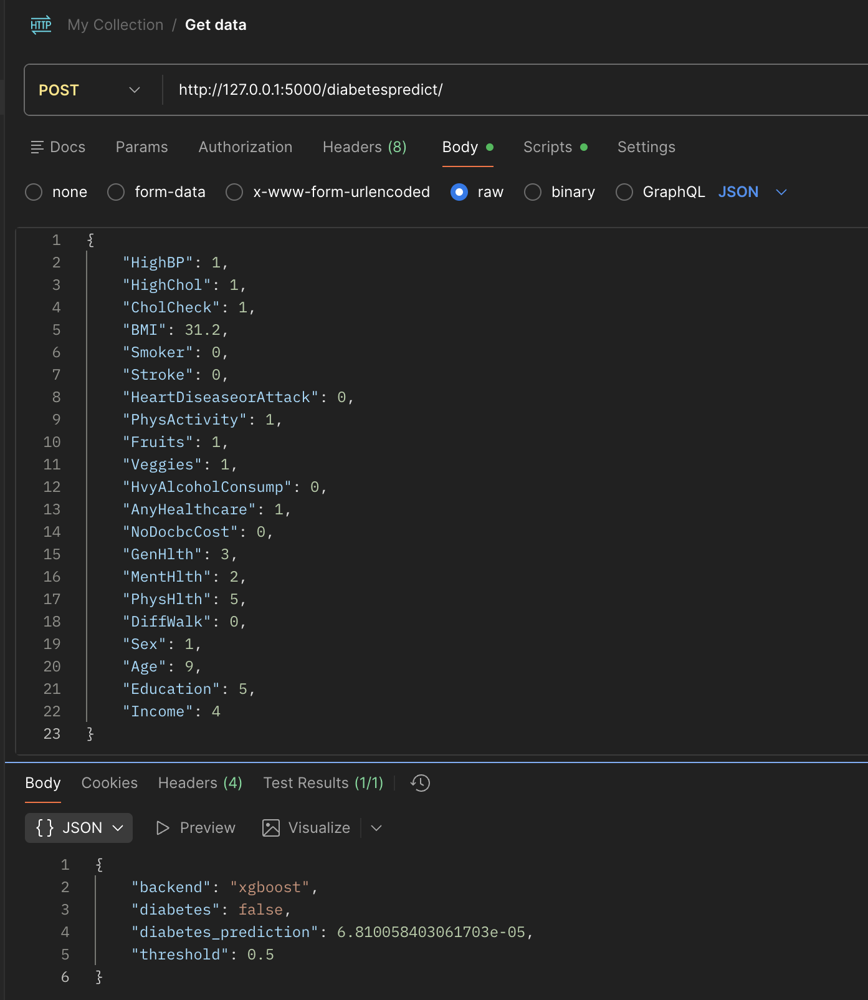
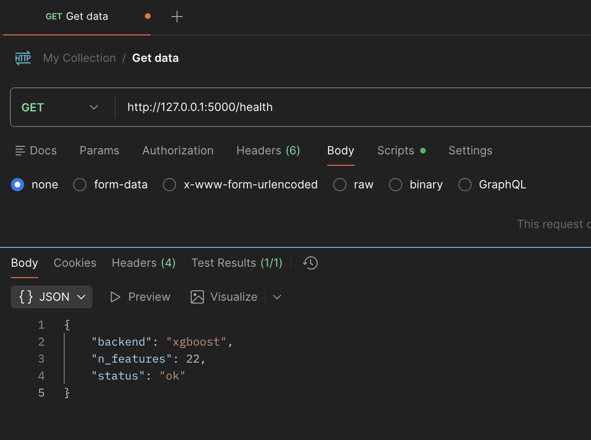
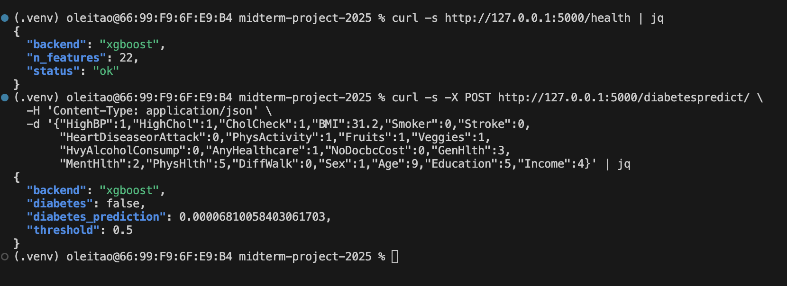
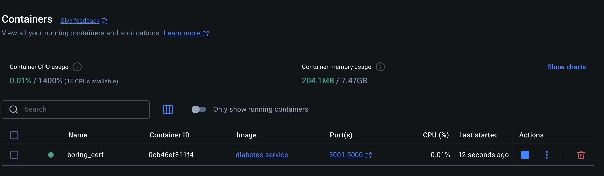

# ML Zoomcamp Midterm Project — Diabetes Prediction Service

End‑to‑end project for training and serving a binary diabetes classifier on the BRFSS 2015 “Diabetes Health Indicators” dataset. It includes model training, a Flask inference API, Docker packaging, and optional deployment to AWS Elastic Beanstalk.

Course: DataTalks.Club Machine Learning Zoomcamp

---

## Overview

- Predicts whether a person has diabetes/prediabetes based on BRFSS health indicators.
- Trains an XGBoost model (with a sklearn fallback) using dictionary vectorization for one‑hot encoding.
- Serves predictions via `POST /diabetespredict/` returning probability and a boolean decision.
- Ships with a ready model artifact (`model_diabetes.bin`) and a Dockerfile for containerized serving.

## Data

- Source: Kaggle — Diabetes Health Indicators (BRFSS 2015)
  https://www.kaggle.com/datasets/alexteboul/diabetes-health-indicators-dataset
- Target: `Diabetes_012` is converted to a binary label: `1` if value > 0 (prediabetes or diabetes), else `0`.
- Features: categorical flags and small categorical integers plus numeric columns `BMI`, `MentHlth`, `PhysHlth`.
- Loading: `model-train.py` loads all CSV files under `data/` matching `diabetes_*.csv` and concatenates them. Adjust `DATA_GLOB` in the script if you want to train on a specific file only.

## Modeling

- Vectorization: `DictVectorizer` for one‑hot encoding of categorical features.
- Algorithms: primary backend is XGBoost; if XGBoost isn’t available, it falls back to `HistGradientBoostingClassifier`.
- Validation: 5‑fold cross‑validation on full‑train and a separate hold‑out test split. Metric: ROC AUC.
- Class imbalance: handled with stratified splits and thresholding; no SMOTE in the final training script. Some exploratory notebooks tried class weights.

## Project Structure

- `data/` — BRFSS CSVs (several variants) and example saved models
- `model-train.py` — trains the model and saves `model_diabetes.bin`
- `predict_model.py` — Flask app exposing the inference API
- `predict-model-test.py` — small client to test the API
- `Dockerfile` — container image for serving the API with `waitress`
- `Pipfile`/`Pipfile.lock` — optional Pipenv setup (Python 3.8)

## Train

Prereqs: Python 3.8–3.11. Ensure the dataset CSVs exist in `data/`.

```bash
python model-train.py
```

This prints K‑Fold scores and a hold‑out AUC, then writes `model_diabetes.bin`.

## Run Locally (Flask)

Option A — plain venv + pip:

```bash
python -m venv .venv
source .venv/bin/activate  # Windows: .venv\Scripts\activate
pip install -U pip
pip install flask waitress xgboost scikit-learn pandas numpy requests
python predict_model.py
```

Option B — Pipenv:

```bash
pip install pipenv
pipenv install numpy scikit-learn==0.24.2 flask pandas requests xgboost
pipenv shell
python predict_model.py
```

Alternatively, run with `waitress` for a production‑style server:

```bash
waitress-serve --listen=127.0.0.1:5000 predict_model:app
```

Environment variables:

- `MODEL_FILE` (default `model_diabetes.bin`) — path to the pickle artifact
- `THRESHOLD` (default `0.5`) — decision threshold for the boolean label

## API

- Health check: `GET /health` → `{ "status": "ok", "backend": "xgboost", "n_features": 21 }`
- Predict: `POST /diabetespredict/` with JSON body. Example payload:

```json
{
  "HighBP": 1, "HighChol": 1, "CholCheck": 1, "BMI": 31.2, "Smoker": 0, "Stroke": 0,
  "HeartDiseaseorAttack": 0, "PhysActivity": 1, "Fruits": 1, "Veggies": 1,
  "HvyAlcoholConsump": 0, "AnyHealthcare": 1, "NoDocbcCost": 0, "GenHlth": 3,
  "MentHlth": 2, "PhysHlth": 5, "DiffWalk": 0, "Sex": 1, "Age": 9, "Education": 5, "Income": 4
}
```

Response:

```json
{
  "diabetes_prediction": 0.42,
  "diabetes": false,
  "threshold": 0.5,
  "backend": "xgboost"
}
```



Quick tests:

```bash
python predict-model-test.py  # uses http://127.0.0.1:5000/diabetespredict/
# or
curl -s http://127.0.0.1:5000/health | jq
curl -s -X POST http://127.0.0.1:5000/diabetespredict/ \
  -H 'Content-Type: application/json' \
  -d '{"HighBP":1,"HighChol":1,"CholCheck":1,"BMI":31.2,"Smoker":0,"Stroke":0,
       "HeartDiseaseorAttack":0,"PhysActivity":1,"Fruits":1,"Veggies":1,
       "HvyAlcoholConsump":0,"AnyHealthcare":1,"NoDocbcCost":0,"GenHlth":3,
       "MentHlth":2,"PhysHlth":5,"DiffWalk":0,"Sex":1,"Age":9,"Education":5,"Income":4}' | jq
```



## Docker

Build and run:

```bash
docker build -t diabetes-service .
docker run -it --rm -p 5000:5000 diabetes-service
```

The image uses `waitress` and exposes port `5000`. Test with the client script:

```bash
python predict-model-test.py --url http://127.0.0.1:5000/diabetespredict/
```

Map a custom host port if needed (e.g., 5001 → 5000):

```bash
docker run -it --rm -p 5001:5000 diabetes-service
python predict-model-test.py --url http://127.0.0.1:5001/diabetespredict/
```



## AWS Elastic Beanstalk (optional)

You can deploy the Docker image using the EB CLI:

```bash
pip install awsebcli  # or: pipenv install awsebcli --dev
eb init -p docker diabetes-serving
eb create diabetes-serving-env
eb deploy
eb open
```

Once the environment is green, use the public URL with the test client:

```bash
python predict-model-test.py --url https://<public-url>/diabetespredict/
```

## Notes & Troubleshooting

- Training data: by default all `data/diabetes_*.csv` files are concatenated. To restrict, edit `DATA_GLOB` in `model-train.py`.
- XGBoost optional: if not available, the script falls back to `HistGradientBoostingClassifier` and still serves probabilities.
- Threshold: tune `THRESHOLD` via env var to prefer recall vs. precision.
- Python version: Pipenv targets Python 3.8; Dockerfile uses Python 3.11. Both paths are tested with current dependencies.

---

Credits: DataTalks.Club ML Zoomcamp for project structure inspiration; dataset by CDC BRFSS via Kaggle.

## Conclusion

This project successfully built and deployed an XGBoost model to predict diabetes risk, providing insights into diabetes-related factors and an accessible web-based tool hosted on AWS.

---
